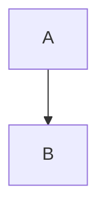

# Руководство по продвинутым функциям (Guide)

## 1. Качество диаграмм Mermaid (High-Res)

Gostdown теперь поддерживает настройку качества диаграмм через файл конфигурации Puppeteer.
Чтобы улучшить разрешение или сменить формат:

1. Создайте файл `puppeteer-config.json` в корне папки вашего отчета (рядом с `main.md`).
2. Пример содержимого для высокого разрешения (2000px):
   ```json
   {
       "width": 2000,
       "height": 2000,
       "format": "png"
   }
   ```
   *Примечание: `mermaid-filter` использует `width` как viewport, что напрямую влияет на разрешение растрового изображения.*

Векторный формат (`pdf` или `svg`) возможен, но Word часто плохо работает с SVG. Мы рекомендуем использовать high-res PNG.

## 2. Система Конфигурации (Config.json)

Больше не нужно править скрипты. Вы можете управлять сборкой через JSON конфиги.

### Глобальный конфиг
Лежит в корне проекта: `config.json`. Задает значения по умолчанию.
```json
{
    "template": "reference.docx",
    "outputs": ["docx", "pdf"],
    "mermaid": true,
    "embedfonts": true,
    "counters": true,
    "bibliography": true,
    "list_trailing_character": "space", // "tab", "space", "none" (отступ после номера)
    "list_number_suffix": "." // Точка после номера (или ")", или "")
}
```

### Локальный конфиг (для каждого отчета)
Создайте `config.json` внутри папки отчета (например `input/my-report/config.json`), чтобы переопределить настройки.

Пример:
```json
{
    "markdown_files": ["01-start.md", "02-middle.md"], // Жесткий порядок файлов (по умолчанию: алфавитный)
    "template": "special-template.docx", // Искать в input/my-report/ ИЛИ в templates/
    "outputs": ["pdf"], // Генерировать только PDF
    "counters": false,
    "list_trailing_character": "tab", // Переопределить отступ на Таб
    "list_number_suffix": ")" // Использовать скобку: "1) Заголовок"
}
```

### Шаблоны (Templates)
Общие шаблоны (например, для разных ГОСТов или кафедр) можно хранить в папке `templates/` в корне проекта. Скрипт сначала ищет шаблон там, если не нашел — ищет внутри папки отчета.

## 3. Структура отчета (Title, Begin, Main, End)

Вы можете разбить отчет на любое количество Markdown-файлов. Скрипт сборки сортирует их по алфавиту и склеивает.

### Рекомендуемая структура:
- `00-header.md` (пустой или метаданные)
- `01-abstract.md` (Реферат)
- `02-intro.md` (Введение)
- `03-chapter1.md`
- ...
- `99-conclusion.md`

### Титульный лист
Вам доступны два способа оформления титульного листа:

1. **Встроенный (по умолчанию)**: Титульный лист является первой страницей вашего `reference.docx`. Скрипт просто вставляет текст отчета после тега `%MAINTEXT%`.
2. **Внешний (рекомендуемый для сложных случаев)**:
   - Создайте файл `title.docx` в папке проекта.
   - Скрипт автоматически найдет его и вставит содержимое **в самое начало** документа (перед основным текстом).
   - После титульного листа будет вставлен разрыв раздела (`Section Break`).
   - Это удобно, если титульник генерируется отдельным инструментом или имеет уникальное форматирование.

## 3. Примеры элементов

### Код (листинги)
Используйте тройные апострофы с указанием языка:

    ```cpp
    #include <iostream>
    int main() { return 0; }
    ```

### Таблицы
Gostdown (Pandoc) поддерживает pipe-tables. Для длинных таблиц (longtable) Word сам должен обрабатывать перенос заголовка, если это настроено в стиле таблицы (`TableStyleGost`).

Пример:
```markdown
| ID | Имя | Описание |
|:---|:----|:---------|
| 1  | Тест| Данные   |
| 2  | Еще | ...      |

: Название таблицы {#tbl:my-table}
```

- `: Название` — создает подпись.
- `{#tbl:id}` — метка для перекрестных ссылок (см. ниже).

### Рисунки (Captions)

```markdown
{#fig:my-fig}
```

Или для Mermaid:
```markdown

Figure: Подпись к диаграмме {#fig:diagram}
```

### Перекрестные ссылки
- На таблицу: `См. таблицу @tbl:my-table`
- На рисунок: `Как показано на рис. @fig:my-fig`

### Источники (Bibliography)
1. Создайте файл `refs.bib` (формат BibTeX) в папке проекта.
2. В тексте используйте ключ цитирования: `Согласно работе [@source_key]`.
3. Скрипт автоматически найдет `.bib` файл и сформирует список литературы в конце.

## 4. Сборка примеров

В папке `input/examples-showcase` создан пример, демонстрирующий всё вышеперечисленное.
Запустите `make output/examples-showcase.docx` чтобы увидеть результат.
